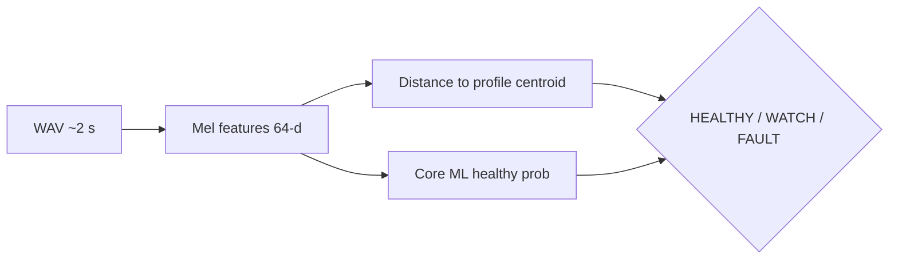

# Clink

**Does it still sound healthy?** Clink listens to short clips of everyday machines—box fans, laptop coolers, vacuums, relay clicks, appliance hum—and flags when the sound drifts from a known-good baseline.

> Layer 1–2: Python training → Core ML + macOS SwiftUI demo. CI and iOS are planned next.

## At a glance

- Five **relatable profile packs** (not plant-only industrial tags)
- **Spectral fingerprint** (64-d mel stats) + per-profile **centroid distance**
- **Core ML** logistic head for advisory healthy probability
- **macOS app**: pick a profile, test bundled healthy/fault WAVs, or import your own
- Optional **Mixkit** golden clips when downloads succeed (synthetic fault pairs stay local)

## How it works



1. **Golden** clip defines the profile centroid (from download or synthesis).
2. **Fault** clip is a paired “something changed” example (synthetic today).
3. At runtime, distance to the centroid is the primary gate; Core ML nudges the WATCH band.

## Profile packs

| ID | Title | Who cares |
|----|--------|-----------|
| `box_fan` | Box fan | Everyone — bedroom hum baseline |
| `laptop_fan` | Laptop / PC fan | EE / CE / SE — thermal & acoustics |
| `vacuum_cleaner` | Vacuum cleaner | Household motor health |
| `relay_click` | Relay / turn signal | EE / test — electromechanical tick |
| `microwave_hum` | Microwave / appliance hum | Mains + magnetron-ish tone |

## Try it

### Layer 1 (train + validate)

```bash
bash scripts/build_layer1.sh
```

### Layer 2 (macOS app)

```bash
cd ClinkApp && swift build -c release && .build/release/Clink
```

Select a profile → **Test healthy sound** / **Test fault sound**, or **Import WAV…**.

## Tests / validation

- `train/validate_clips.py` — golden PASS, fault FAIL (distance-primary)
- `scripts/build_layer1.sh` — full Layer 1 pipeline

## Documentation

| Doc | Contents |
|-----|----------|
| `train/README.md` | Feature vector, export paths, dependencies |
| `ClinkApp/README.md` | SwiftPM layout, resources bundle |

## Technical depth

<details>
<summary>Repository layout</summary>

```
train/           # synthesize, download, features, Core ML export
samples/         # golden / fault WAV pairs
profiles/        # per-pack profile.json (centroid + threshold)
models/          # ClinkHealth.mlpackage, mel_filters.json
ClinkApp/        # SwiftUI macOS executable
scripts/         # build_layer1.sh
```

</details>

- Sample rate **22.05 kHz**, **2.0 s** clips, **64** features (32 mel means + 32 stds).
- Core ML export via **PyTorch JIT** → `ClinkHealth.mlpackage` (macOS 13+).
- Golden audio may come from [Mixkit](https://mixkit.co/license/) previews when `download_samples.py` succeeds.

MIT — see `LICENSE`.
