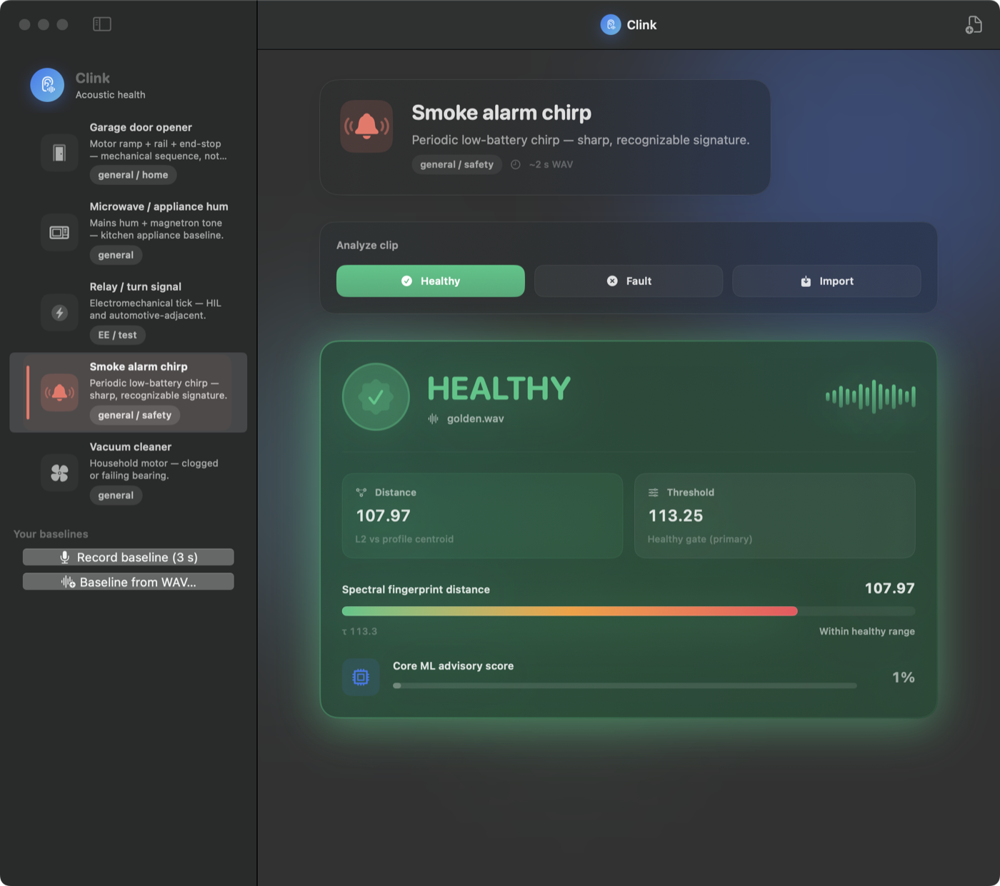
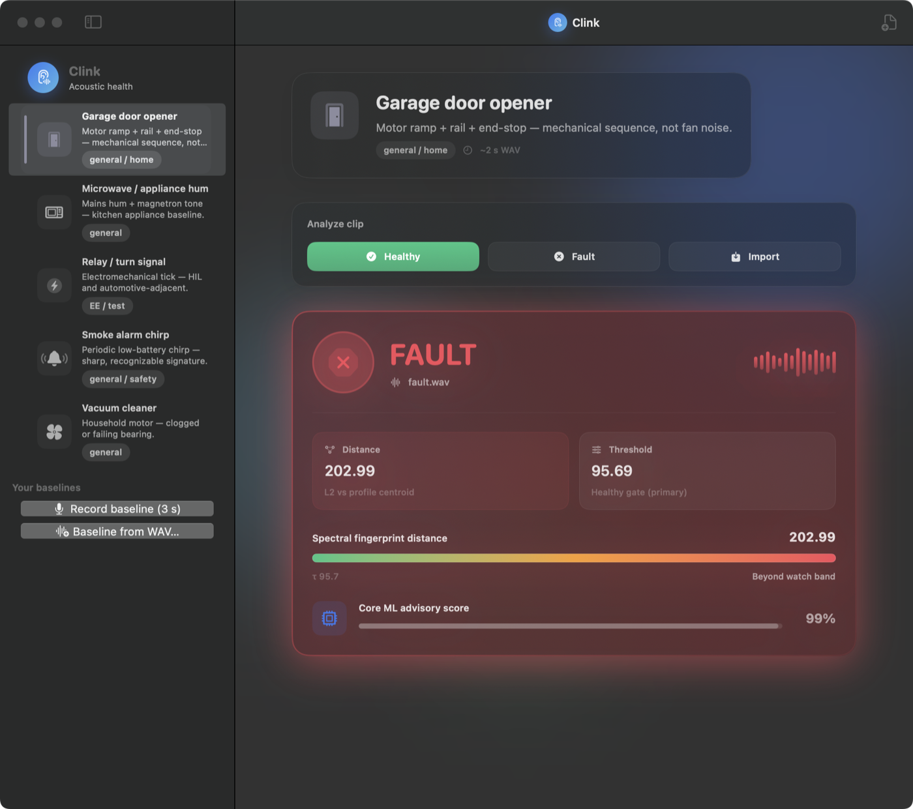
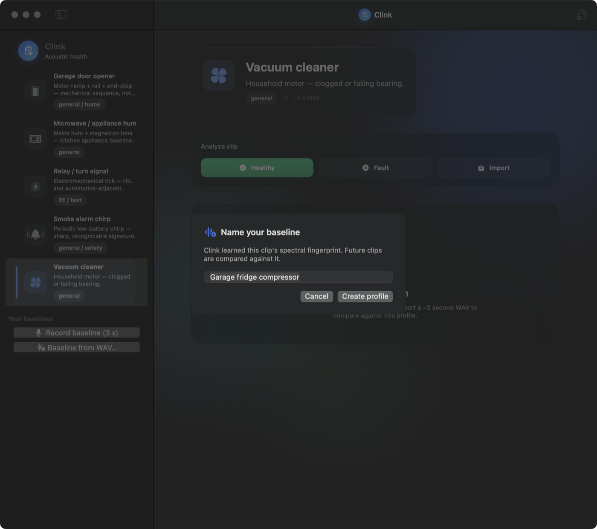
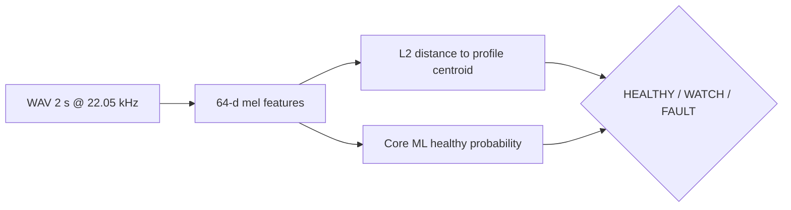

# Clink

[](https://github.com/chaffybird56/clink/actions/workflows/ci.yml)

**Does it still sound healthy?** Drop a ~2 second WAV — or record one — pick a profile, and get **HEALTHY**, **WATCH**, or **FAULT** — acoustic drift detection on your Mac, with on-device Core ML.

> **Layers 1–4 shipped:** Python train → Core ML, macOS SwiftUI app, GitHub Actions CI, and **record-your-baseline** custom profiles. `ClinkCore` compiles for iOS.

<p align="center">
  
</p>

| Drift gets flagged | Teach it your machine |
|---|---|
|  |  |
| Same profile, drifted clip → **FAULT**: distance 202.99 vs gate 95.7, beyond the watch band. | **Record baseline (3 s)** or import a WAV → Clink learns its fingerprint as a new profile. |

## At a glance

| | |
|---|---|
| **Problem** | Machines change sound before they fail — fans, motors, relays, alarms. |
| **Approach** | Learn a **golden spectral fingerprint** per profile; flag clips that drift too far. |
| **Why not “box fan”?** | Fan pitch varies by make/RPM — we use **distinct signatures** (chirp, door sequence, relay tick) for honest demos. |
| **Stack** | 64-d mel stats · centroid distance · Core ML advisory head · SwiftUI macOS app |

## Profile packs (distinct signatures)

| ID | What it sounds like | Who cares |
|----|---------------------|-----------|
| `smoke_alarm_chirp` | Periodic high chirp (low-battery style) | Everyone — safety-adjacent |
| `garage_door` | Motor + rail + end-stop (not a generic hum) | Home / mechanical sequence |
| `vacuum_cleaner` | Motor whoosh — clog or bearing drift | Household |
| `relay_click` | Sharp electromechanical tick train | EE / test / HIL |
| `microwave_hum` | Mains hum + appliance tone | Kitchen baseline |

Bundled **golden** clips come from [Mixkit](https://mixkit.co/license/) when online; **fault** pairs are synthetic “something changed” examples for one-click demo in the app.

**Important:** A profile is **your** healthy baseline (this clip’s centroid), not “every smoke alarm in the world.” Record or import your own clip — see [Record your baseline](#record-your-baseline-layer-4).

## How it works



1. **Golden** WAV → profile centroid + distance threshold.  
2. **New clip** → same features → compare distance (primary) and ML score (advisory / WATCH band).  
3. **Fault** demo clip should land **FAULT** in the macOS app’s test buttons.

## Quick start

### Layer 1 — train & validate

```bash
git clone https://github.com/chaffybird56/clink.git
cd clink
bash scripts/build_layer1.sh
```

### Layer 2 — macOS app

```bash
cd ClinkApp
swift build -c release
.open .build/release/Clink   # or: .build/release/Clink
```

In the app: select a profile → **Test healthy sound** / **Test fault sound** / **Import WAV…**.

**Headless local check** (same logic as the GUI, no window):

```bash
cd ClinkApp && swift build -c release && .build/release/Clink --demo
```

Expect every **golden → HEALTHY**, every **fault → WATCH or FAULT** (not healthy), plus a Layer 4 baseline self-check.

## Record your baseline (Layer 4)

Bundled packs are demos — the real workflow is teaching Clink **your** machine:

- **GUI:** sidebar → **Your baselines** → *Record baseline (3 s)* (mic) or *Baseline from WAV…* → name it. Custom profiles persist in `~/Library/Application Support/Clink/profiles/` and can be deleted from the context menu.
- **CLI:**

```bash
.build/release/Clink --make-profile path/to/healthy.wav --id my_fridge --name "Garage fridge"
```

The clip is sliced into overlapping 2 s windows; the **centroid** is the mean fingerprint and the **threshold self-calibrates** from worst intra-clip drift (×1.6 headroom, floored so steady sounds keep a WATCH band). Any WAV format works — input is resampled to 22.05 kHz mono.

## Validation (automated)

`scripts/build_layer1.sh` ends with `train/validate_clips.py` — every golden **PASS**, every fault **FAIL** (distance-primary).

<!-- VALIDATION:START -->
| Profile | Clip | Result | Distance | Threshold | ML healthy |
|---------|------|--------|----------|-----------|------------|
| Garage door opener | golden | PASS | 0.00 | 95.69 | 2% |
| Garage door opener | fault | PASS | 191.39 | 95.69 | 96% |
| Microwave / appliance hum | golden | PASS | 0.00 | 61.55 | 14% |
| Microwave / appliance hum | fault | PASS | 123.10 | 61.55 | 100% |
| Relay / turn signal | golden | PASS | 0.00 | 114.97 | 0% |
| Relay / turn signal | fault | PASS | 229.94 | 114.97 | 99% |
| Smoke alarm chirp | golden | PASS | 0.00 | 113.25 | 15% |
| Smoke alarm chirp | fault | PASS | 120.93 | 113.25 | 97% |
| Vacuum cleaner | golden | PASS | 0.00 | 48.11 | 7% |
| Vacuum cleaner | fault | PASS | 96.23 | 48.11 | 100% |
<!-- VALIDATION:END -->

Regenerate this table after retraining:

```bash
python scripts/update_readme_validation.py
```

## Tests

| Gate | Purpose |
|------|---------|
| `scripts/build_layer1.sh` | Synthesize → download → train → export → validate → refresh parity fixtures |
| `cd ClinkApp && swift test` | Swift↔Python **feature parity**, status bands, baseline builder, custom-profile persistence |
| `Clink --demo` | Headless: every golden→HEALTHY, fault→FAULT + baseline self-check |
| `scripts/smoke_test.sh` | Validate + demo + unit tests in one shot |
| `train/validate_clips.py` | Per-profile golden/fault gate |

**CI (Layer 3):** [GitHub Actions](.github/workflows/ci.yml) runs all of the above on every push — a Python train/validate job, a Swift build + tests + demo job, and an **iOS Simulator compile check** for `ClinkCore`.

## Documentation

| Path | Contents |
|------|----------|
| [train/README.md](train/README.md) | Features, dependencies, export paths |
| [ClinkApp/README.md](ClinkApp/README.md) | SwiftPM layout and resources |

## Roadmap

- [x] Layer 1 — Python train → Core ML export + clip validation
- [x] Layer 2 — macOS SwiftUI app + headless demo gate
- [x] Layer 3 — GitHub Actions (train + validate, Swift build + tests + demo, iOS compile)
- [x] Layer 4 — Record-your-baseline flow (mic + WAV import, self-calibrated threshold)
- [x] User-defined profiles (fans OK when **you** supply the golden clip)
- [x] README screenshots (`scripts/capture_screenshots.sh` — deterministic `--auto` states)
- [ ] iOS app target (ClinkCore already compiles for iOS)

<details>
<summary>Technical depth — layout & signal chain</summary>

```
train/              synthesize, download_samples, features, train_and_export
samples/golden|fault/   WAV pairs per profile
profiles/           manifest + per-pack profile.json (centroid, threshold)
models/             ClinkHealth.mlpackage, mel_filters.json
ClinkApp/           ClinkCore library + SwiftUI executable + bundled Resources
ClinkApp/Tests/     ClinkCoreTests (parity fixtures committed)
scripts/            build_layer1.sh, smoke_test.sh, export_parity_fixture.py, capture_screenshots.sh
.github/workflows/  ci.yml (Layer 3)
```

- **Audio:** 22.05 kHz, 2.0 s mono, Hann window, 2048 FFT, 32 mel bands (fmax 8 kHz).  
- **Features:** mel power → `power_to_db(ref=max)` → per-band mean + std (64-d).  
- **Classifier:** logistic regression exported via PyTorch JIT → `ClinkHealth.mlpackage` (macOS 13+, iOS 16+).  
- **Scoring in app:** `distance ≤ threshold` → HEALTHY; up to 1.1× threshold → WATCH; else FAULT.  
- **Custom baselines (Layer 4):** overlapping 2 s windows → mean centroid; threshold = `max(30, 1.6 × worst intra-clip drift)`; mic capture via AVAudioEngine → 22.05 kHz mono WAV.

</details>

MIT — see [LICENSE](LICENSE).
