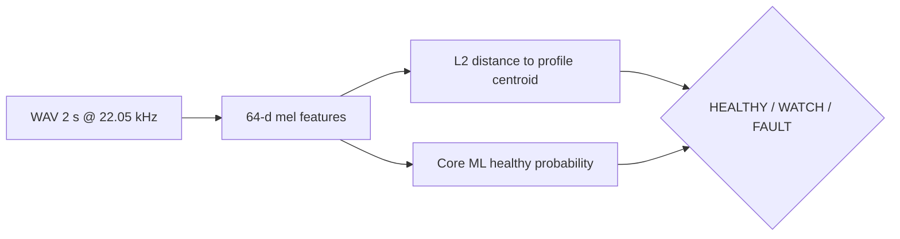

# Clink

**Does it still sound healthy?** Drop a ~2 second WAV, pick a profile, and get **HEALTHY**, **WATCH**, or **FAULT** — acoustic drift detection on your Mac, with on-device Core ML.

> **Layers 1–2 shipped:** Python train → Core ML + macOS SwiftUI demo. CI, iOS, and “record your baseline” are next.

## At a glance

| | |
|---|---|
| **Problem** | Machines change sound before they fail — fans, motors, relays, alarms. |
| **Approach** | Learn a **golden spectral fingerprint** per profile; flag clips that drift too far. |
| **Why not “box fan”?** | Fan pitch varies by make/RPM — we use **distinct signatures** (chirp, door sequence, relay tick) for honest demos. |
| **Stack** | 64-d mel stats · centroid distance · Core ML advisory head · SwiftUI macOS app |

## Profile packs (distinct signatures)

| ID | What it sounds like | Who cares |
|----|---------------------|-----------|
| `smoke_alarm_chirp` | Periodic high chirp (low-battery style) | Everyone — safety-adjacent |
| `garage_door` | Motor + rail + end-stop (not a generic hum) | Home / mechanical sequence |
| `vacuum_cleaner` | Motor whoosh — clog or bearing drift | Household |
| `relay_click` | Sharp electromechanical tick train | EE / test / HIL |
| `microwave_hum` | Mains hum + appliance tone | Kitchen baseline |

Bundled **golden** clips come from [Mixkit](https://mixkit.co/license/) when online; **fault** pairs are synthetic “something changed” examples for one-click demo in the app.

**Important:** A profile is **your** healthy baseline (this clip’s centroid), not “every smoke alarm in the world.” Import your own WAV when you move to a real device.

## How it works



1. **Golden** WAV → profile centroid + distance threshold.  
2. **New clip** → same features → compare distance (primary) and ML score (advisory / WATCH band).  
3. **Fault** demo clip should land **FAULT** in the macOS app’s test buttons.

## Quick start

### Layer 1 — train & validate

```bash
git clone https://github.com/chaffybird56/clink.git
cd clink
bash scripts/build_layer1.sh
```

### Layer 2 — macOS app

```bash
cd ClinkApp
swift build -c release
.open .build/release/Clink   # or: .build/release/Clink
```

In the app: select a profile → **Test healthy sound** / **Test fault sound** / **Import WAV…**.

## Validation (automated)

`scripts/build_layer1.sh` ends with `train/validate_clips.py` — every golden **PASS**, every fault **FAIL** (distance-primary).

<!-- VALIDATION:START -->
| Profile | Clip | Result | Distance | Threshold | ML healthy |
|---------|------|--------|----------|-----------|------------|
| Garage door opener | golden | PASS | 0.00 | 96.04 | 2% |
| Garage door opener | fault | PASS | 192.07 | 96.04 | 96% |
| Microwave / appliance hum | golden | PASS | 0.00 | 61.13 | 15% |
| Microwave / appliance hum | fault | PASS | 122.26 | 61.13 | 100% |
| Relay / turn signal | golden | PASS | 0.00 | 114.97 | 0% |
| Relay / turn signal | fault | PASS | 229.94 | 114.97 | 99% |
| Smoke alarm chirp | golden | PASS | 0.00 | 60.46 | 15% |
| Smoke alarm chirp | fault | PASS | 120.93 | 60.46 | 96% |
| Vacuum cleaner | golden | PASS | 0.00 | 48.19 | 7% |
| Vacuum cleaner | fault | PASS | 96.37 | 48.19 | 100% |
<!-- VALIDATION:END -->

Regenerate this table after retraining:

```bash
python scripts/update_readme_validation.py
```

## Tests

| Script | Purpose |
|--------|---------|
| `scripts/build_layer1.sh` | Synthesize → download → train → export → validate |
| `scripts/smoke_test.sh` | Validate + confirm release binary exists |
| `train/validate_clips.py` | Per-profile golden/fault gate |

## Documentation

| Path | Contents |
|------|----------|
| [train/README.md](train/README.md) | Features, dependencies, export paths |
| [ClinkApp/README.md](ClinkApp/README.md) | SwiftPM layout and resources |

## Roadmap

- [ ] Layer 3 — GitHub Actions (train + validate on push)
- [ ] Layer 4 — Record-your-baseline flow + iOS
- [ ] User-defined profiles (fans OK when **you** supply the golden clip)

<details>
<summary>Technical depth — layout & signal chain</summary>

```
train/              synthesize, download_samples, features, train_and_export
samples/golden|fault/   WAV pairs per profile
profiles/           manifest + per-pack profile.json (centroid, threshold)
models/             ClinkHealth.mlpackage, mel_filters.json
ClinkApp/           SwiftUI executable + bundled Resources
scripts/            build_layer1.sh, smoke_test.sh
```

- **Audio:** 22.05 kHz, 2.0 s mono, Hann window, 2048 FFT, 32 mel bands (fmax 8 kHz).  
- **Features:** mel power → `power_to_db(ref=max)` → per-band mean + std (64-d).  
- **Classifier:** logistic regression exported via PyTorch JIT → `ClinkHealth.mlpackage` (macOS 13+).  
- **Scoring in app:** `distance ≤ threshold` → HEALTHY; up to 1.2× threshold → WATCH; else FAULT.

</details>

MIT — see [LICENSE](LICENSE).
